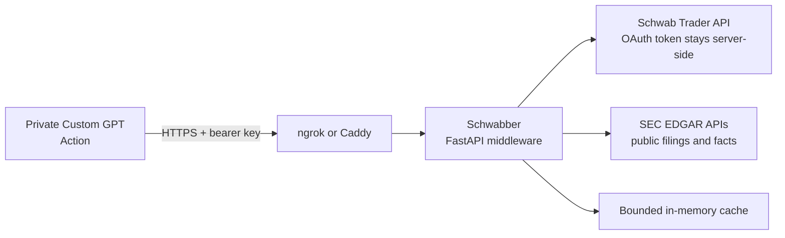

# Architecture

Schwabber is a small research gateway that keeps the GPT-facing contract
separate from external provider APIs.

## Boundaries

- The GPT receives normalized, bounded research responses, never Schwab OAuth
  tokens or account credentials.
- Schwabber exposes read-only market and filing research. It does not place
  orders or expose account balances, positions, or account numbers.
- Web search remains the GPT's source for current news; Schwabber does not
  scrape or redistribute news.
- Schwab and SEC providers are isolated behind separate adapters so either
  provider can be unavailable without taking down the other.

## Design Record

The detailed design and implementation decisions are recorded here:

- [Research gateway design specification](superpowers/specs/2026-08-28-schwabber-research-gateway-design.md)
- [Phase 1: core Schwab Action](superpowers/plans/2026-08-28-phase-1-core-schwab-action.md)
- [Phase 2: SEC research](superpowers/plans/2026-08-28-phase-2-sec-research.md)
- [Phase 3: production release](superpowers/plans/2026-08-28-phase-3-production-release.md)
